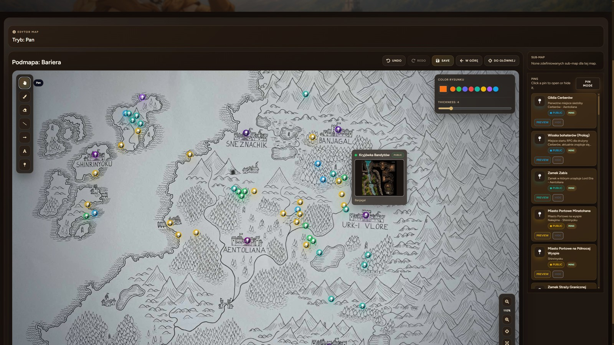
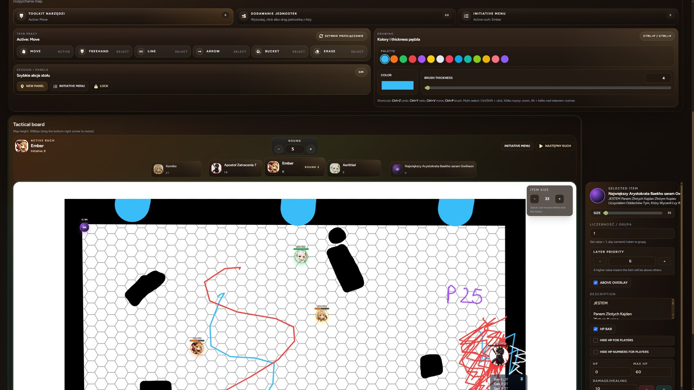
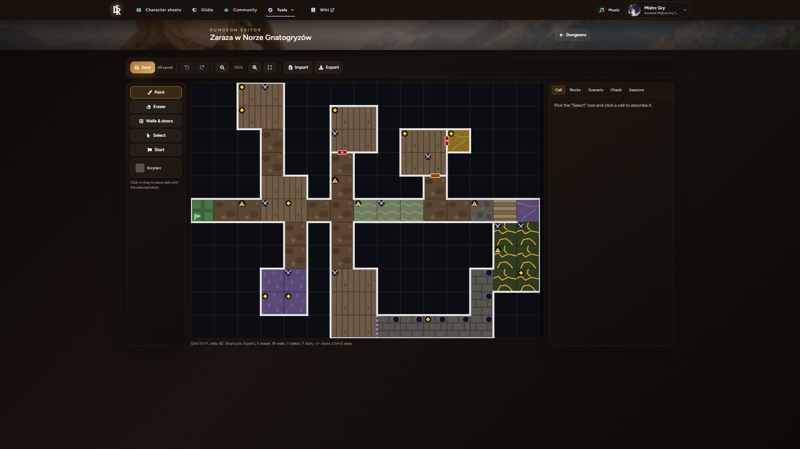
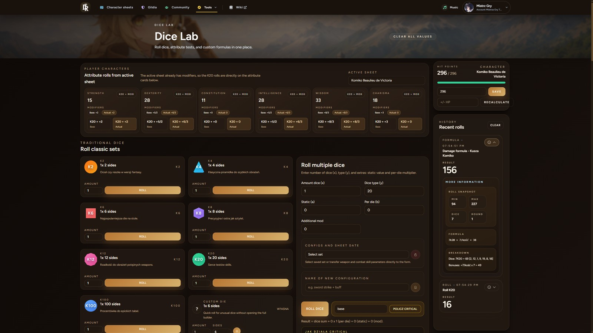
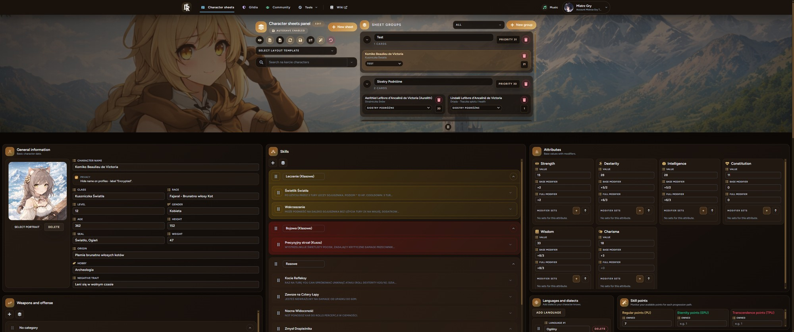
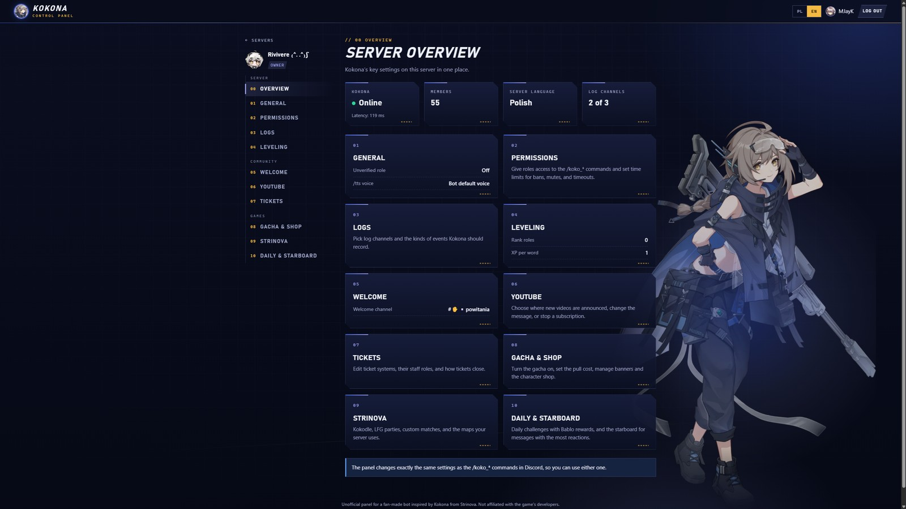
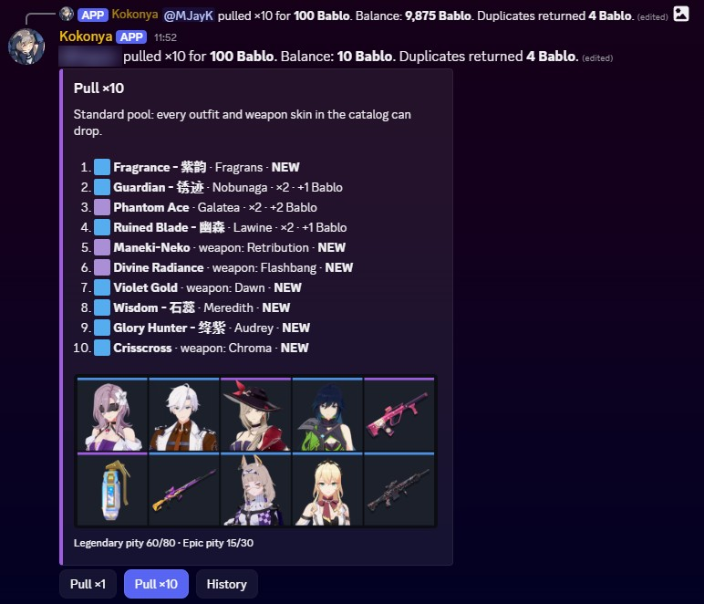

### Full-stack developer · Laravel · React · AI

Hi, I'm Jakub. At work I write PHP (Laravel, Yii2) and Angular, mostly e-contract, recruitment and appointment booking systems. After hours I build things I use myself: a platform for my RPG campaigns and a few Discord bots for communities I'm in.

I have a master's in AI from Adam Mickiewicz University. At work I set up Claude and Codex as coding agents and write simple harnesses for them.

Most of my code is in private repos. If you're hiring and want to see some of it, message me and I'll give you access or show it on a call.

## Projects

### The Domed Realms

A platform for running tabletop RPG campaigns, in Polish and English. Live at [thedomedrealms.usermd.net](https://thedomedrealms.usermd.net)

- character sheets with a drag & drop layout, a dice simulator with custom formulas tied to character stats, a world map with pins, guilds with roles and permissions, a wiki, choose-your-path stories
- live battle map: my own WebSocket server in Node.js, HMAC-signed tickets, separate data for the GM and the players
- dungeon module with an editor and fog of war; the GM can have AI generate a scenario from their own conditions, following my spec, and import it as JSON
- Google and Discord login, 3 themes, about 150 tests (PHPUnit, node:test)

`Laravel 12` `React 18` `Inertia.js` `Node.js` `MySQL` `Tailwind CSS`

  
  

  
  

  

### Discord bots: Kokona and Rosmontis

Bots for running Discord servers, both in production. Admin panel: [kokona.thedomedrealms.usermd.net](https://kokona.thedomedrealms.usermd.net)

- Kokona: about 60 commands (moderation, tickets, verification, XP levels, economy and gacha, matchmaking and match lobbies, TTS), Polish and English
- the bot talks to a PHP REST API; every request is HMAC-signed and protected against replay, plus an admin panel with Discord login
- Rosmontis: AI chat through Groq and Gemini, with retries, rate limits and knowledge pulled from the game's wiki
- about 75 test files, SQL migrations, my own deploy scripts and a cron watchdog

`Node.js` `TypeScript` `discord.js` `PHP` `MySQL` `Groq` `Gemini`

  
  

### Marketplace platform (in progress)

Details are confidential for now. On the technical side:

- monorepo (pnpm, Turborepo): modular Laravel 13 API, React 19 + TanStack web app, Expo mobile app
- live chat through Laravel Reverb, an OpenAPI contract and a TypeScript client generated from it
- 1300+ tests (Pest, Vitest), strict PHPStan, Docker Compose environment
- AI agent harness: AGENTS.md, Claude Code hooks and automatic checks before every commit

`Laravel 13` `React 19` `TypeScript` `PostgreSQL` `Valkey` `Reverb` `Docker`

### Smaller things

- **TierList**: a drag & drop tier list for 282 skins, with data collected by a Python scraper
- **Browser games** in plain JavaScript: a turn-based strategy game and a logic puzzle
- **Training AI models**: fine-tuning LLMs and training LoRAs for image models

## What I use

**Every day:** `PHP` `Laravel` `Yii2` `Angular` `TypeScript` `React` `MySQL`

**Also know well:** `Node.js` `Next.js` `Python` `PostgreSQL` `Redis` `Docker` `WebSocket`

**AI:** `Claude` `GPT Codex` `Gemini` `Groq` `AI agents` `LLM fine-tuning` `LoRA`

## Outside of code

I run tabletop RPG sessions as a GM and I'm writing my own game system (the rulebook is at 171 pages so far). I also give talks at fan conventions, for example Hikari.

## Contact

[LinkedIn](https://www.linkedin.com/in/jakub-zar%C4%99ba-7a78311b0/) · jakubzareba99@gmail.com